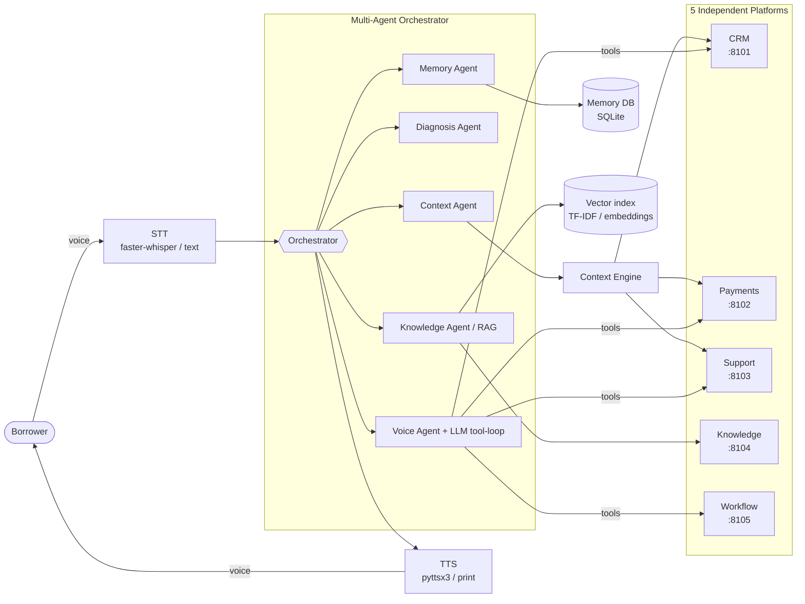
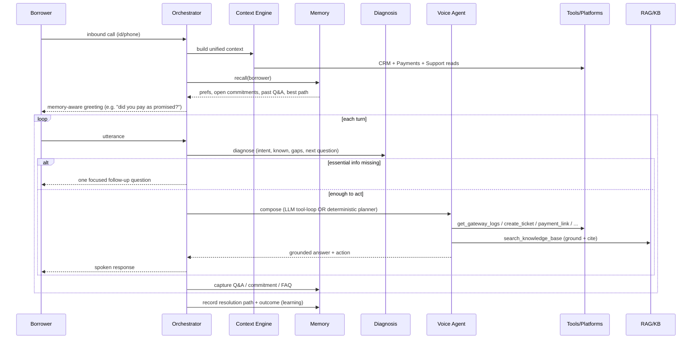

# Architecture

## 1. System context



## 2. Request lifecycle (one call)



## 3. Components

| Layer | Module | Responsibility |
|---|---|---|
| **Platforms** | `platforms/{crm,payments,support,knowledge,workflow}` | Five independent FastAPI services, each owning a domain slice + its own writes. Emulate Zoho/HubSpot, Razorpay/Stripe, Freshdesk, Notion, n8n. |
| **Clients** | `core/clients.py` | Typed HTTP wrappers with graceful degradation (read fallback to local data if a service is down). |
| **Context Engine** | `core/context_engine.py` | Aggregates borrower + interaction + operational context; derives loan analytics (EMIs paid/remaining, interest/principal split, outstanding, next due, overdue, penalties). |
| **Diagnosis Layer** | `core/diagnosis.py` | Intent classification + slot-based gap analysis; emits prioritized, de-duplicated, dynamically-phrased follow-ups; suggests tools + KB queries. |
| **RAG** | `core/rag.py` | Chunk + index KB; pluggable TF-IDF (default) or neural embeddings; citation-ready retrieval. |
| **Memory** | `core/memory.py` | Borrower / conversation / agent memory in SQLite; `recall()` + `best_resolution_path()` drive continuous learning. |
| **Tools** | `core/tools.py` | 11 real actions (read systems, create ticket, payment link, reversal, callback, escalate, record commitment). Shared by LLM loop and deterministic planner. |
| **LLM** | `core/llm.py` | Pluggable reasoning: Anthropic tool-use loop (with prompt caching) or null-LLM fallback. |
| **Agents** | `agents/*` | Context / Diagnosis / Knowledge / Memory / Voice agents + the Orchestrator that coordinates them. |
| **Voice** | `voice/{stt,tts}.py` | Local STT/TTS with text fallbacks. |
| **Eval + Dashboard** | `eval/`, `dashboard/` | Evaluation harness + self-contained HTML analytics dashboard. |

## 4. Key design decisions
1. **Diagnosis drives questioning, not a script.** Slots are *derivable* (resolved from
   systems — never asked) or *ask-only* (only the borrower knows). Only missing,
   essential ask-only slots become questions → no redundant questioning.
2. **Tools are shared between LLM and fallback.** The same tool registry powers the
   Anthropic tool-use loop and the offline deterministic planner, so behaviour and
   side-effects are identical with or without a key.
3. **Grounding is enforced.** Policy intents must cite a KB doc-id; the evaluator
   measures grounding rate.
4. **Memory is the differentiator.** `recall()` runs before every call; the opener is
   memory-aware; agent memory records which resolution paths actually work.
5. **Degrade gracefully.** Missing services, missing LLM key, missing voice deps — each
   has a fallback. This is a production-readiness stance, not a demo shortcut.
```
